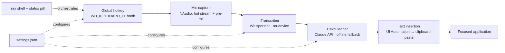

# FlowDictate 🎤

**Press a key anywhere in Windows. Speak. Release. Clean, polished text appears at your cursor — in under two seconds.**

A hotkey-driven AI dictation tool for Windows, inspired by [Wispr Flow](https://wisprflow.ai). Speech recognition runs **fully on-device** (whisper.cpp); a fast Claude pass turns raw speech into writing-quality text — filler words removed, punctuation added, self-corrections resolved ("Tuesday, wait no, Friday" → "Friday").


*<!-- placeholder: hero demo GIF — dictating into Notepad with the status pill visible -->*

## The problem

Typing is the bottleneck between thinking and writing. People speak at 150+ words per minute but type at ~45. Built-in dictation (Win+H) transcribes *literally* — every "um," every false start, no punctuation — so you spend the saved time editing. Cloud dictation tools fix the text but ship your voice to a server and charge a subscription.

## The solution

FlowDictate splits the pipeline at the privacy boundary:

- **Your voice never leaves the machine.** Transcription is local (whisper.cpp on CPU).
- **Only text goes to the cloud** — one short Claude API call polishes the transcript, with a fully offline rule-based fallback.
- **It works everywhere.** Text is inserted at the cursor of whatever app has focus: Word, Outlook, Slack, VS Code, browsers.

## Features

| | |
|---|---|
| ⌨️ **Global hotkey** | Hold CapsLock to talk, release to insert. Double-tap for hands-free. Shift+CapsLock keeps normal caps behavior. |
| 🔒 **On-device transcription** | Whisper (small.en) via whisper.cpp — offline, free, private. Swappable behind an `ITranscriber` interface. |
| ✨ **AI cleanup** | Claude removes fillers, punctuates, and resolves self-corrections. Degrades gracefully to an offline cleaner. |
| 🗣️ **Voice commands on selection** | Select text, hold the key, say "make this more concise" — the selection is transformed in place. |
| 🎯 **App-aware tone** | Formal in Outlook, casual in Slack — configurable per app. |
| 📖 **Custom dictionary** | Teach it your names and jargon; hints both the recognizer and the cleanup pass. |
| 💊 **Status pill** | Floating listening/processing indicator that never steals focus. |
| 🚀 **Runs in the tray** | Silent startup, launch at sign-in, ~0.4 s audio pre-roll so first words are never clipped. |

## Architecture



Every stage sits behind an interface (`ITranscriber`, `ITextCleaner`), so the local model or the cleanup provider can be swapped without touching the pipeline. Full details in [docs/architecture.md](docs/architecture.md).

## Tech stack

- **C# / .NET 8**, WinForms tray shell + WPF UI Automation interop
- **NAudio** — microphone capture (WinMM/WASAPI)
- **Whisper.net** — whisper.cpp bindings for on-device speech-to-text
- **Anthropic C# SDK** — Claude API for the cleanup pass
- **Win32 interop** — low-level keyboard hook, `SendInput`, UI Automation

## Installation (Windows)

Requires Windows 10/11 and the [.NET 8 SDK](https://dotnet.microsoft.com/download/dotnet/8.0).

```powershell
git clone https://github.com/<you>/flowdictate.git
cd flowdictate/src/FlowDictate
dotnet build -c Release

# Download an on-device Whisper model (~142 MB base / ~466 MB small)
mkdir "$env:APPDATA\FlowDictate\models"
curl.exe -L -o "$env:APPDATA\FlowDictate\models\ggml-base.en.bin" `
  "https://huggingface.co/ggerganov/whisper.cpp/resolve/main/ggml-base.en.bin"

# Run
.\bin\Release\net8.0-windows\FlowDictate.exe
```

Optional: add your Anthropic API key for AI cleanup — tray icon → **Open Settings File** → set `AnthropicApiKey` (or set the `ANTHROPIC_API_KEY` environment variable). Without a key, an offline rule-based cleaner handles fillers and punctuation.

## Usage

1. Click into any text field — any app.
2. **Hold CapsLock** and speak naturally, fillers and all.
3. **Release.** Clean text appears at your cursor in ~1–3 seconds.

Also: **double-tap CapsLock** for hands-free mode (tap again to finish), **select text first** to give voice instructions like "turn this into bullet points," and right-click the tray icon for settings, logs, and launch-at-startup.

## Screenshots

| Status pill while listening | Settings | Debug log |
|---|---|---|
|  |  |  |

*<!-- placeholders — capture from a live session -->*

## Measured performance

On a Core Ultra 9 laptop (CPU-only inference):

| Stage | Typical |
|---|---|
| Transcription (small.en, 5 s utterance) | ~2.0 s |
| Claude cleanup (claude-haiku-4-5) | ~0.9 s |
| **Release-to-insert, end to end** | **for short phrases ~1.7 s; longer utterances 2–3.5 s** |

## Future improvements

- Streaming transcription during speech (would cut perceived latency to near-zero)
- Voice-triggered snippets ("insert my address")
- Settings UI (currently a JSON file) and a signed installer
- GPU inference for faster local transcription with larger models
- Multi-language dictation

## License

[MIT](LICENSE)
