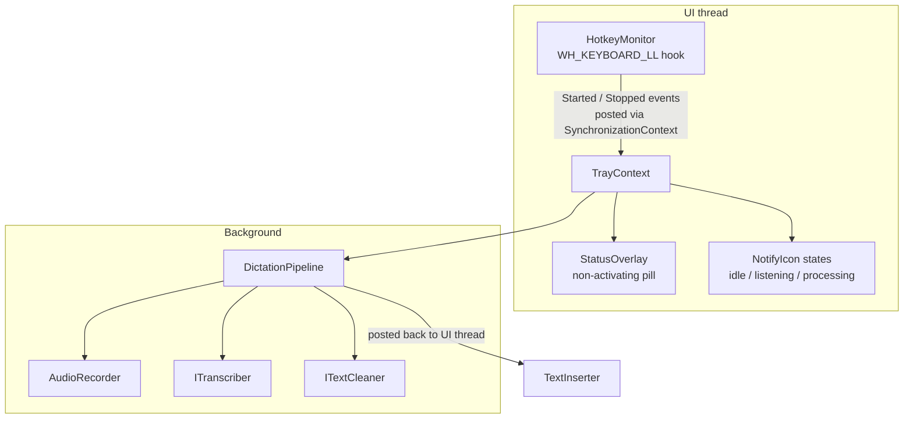
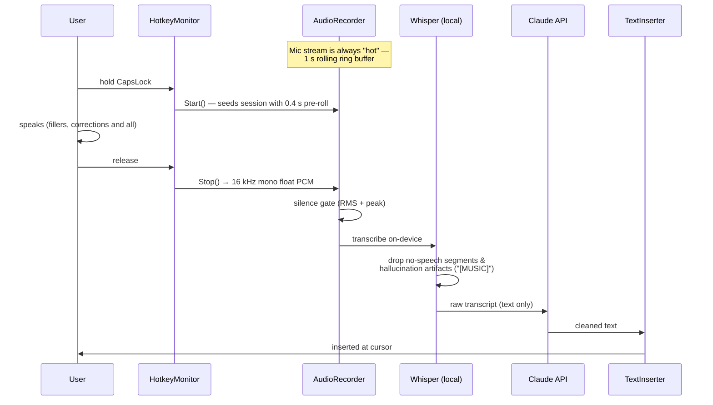
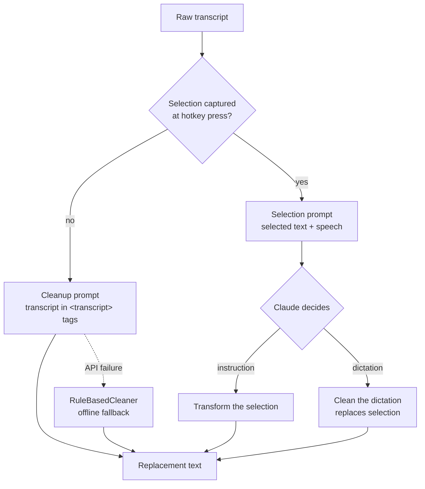

# FlowDictate — Architecture

This document explains how FlowDictate works internally: the desktop application flow, the speech pipeline, the Claude integration, keyboard automation, error handling, and how the design scales.

## 1. Desktop application flow

FlowDictate is a single-process WinForms tray application. There is no main window: a `TrayContext` (an `ApplicationContext`) owns the tray icon, the floating status pill, the hotkey monitor, and the dictation pipeline.



**Threading rules that keep it stable:**

- The keyboard hook callback must return in single-digit milliseconds (Windows silently removes slow hooks and it blocks all keyboard input). All real work is *posted* to the UI message queue, never executed inside the callback.
- Clipboard and UI Automation calls require the STA/UI thread; transcription and the API call run on background threads; completion events are marshaled back with `SynchronizationContext.Post`.
- Exceptions can never escape the hook callback or the audio callback — both would terminate the process.

## 2. Speech pipeline



Key decisions in this pipeline:

- **Hot mic + pre-roll.** Opening an audio device takes long enough to clip the first spoken word. The capture stream runs continuously into a 1-second ring buffer; a session starts by copying the last 400 ms out of the ring. Audio outside a session only ever exists in that 1-second window.
- **Silence gate.** Whisper *hallucinates* plausible text on non-speech audio. Three defenses: an energy gate (RMS/peak thresholds), Whisper's own per-segment no-speech probability, and a filter for bracket artifacts like `[MUSIC]`.
- **Normalization in one place.** Capture happens at whatever format the device supports (with fallbacks), then is downmixed and resampled to the 16 kHz mono float PCM Whisper expects.

## 3. Claude API flow



Implementation notes:

- **Official Anthropic C# SDK**, one `messages.create` call per dictation. Default model is configurable; `claude-haiku-4-5` gives ~0.9 s cleanup latency, `claude-opus-4-8` gives maximum quality at ~2–3 s.
- **Prompt-injection hardening.** The transcript is wrapped in `<transcript>` tags with an explicit rule that its content is *never* addressed to the model. Without this, saying "turn this into bullet points" with nothing selected made the model reply conversationally — and its reply got typed into the user's document. (Found in real use; regression-tested since.)
- **Tone and dictionary are prompt suffixes.** The foreground app maps to a tone hint ("formal, professional" for Outlook); the custom dictionary is appended as the authoritative spelling list. Neither changes the pipeline.
- **Graceful degradation.** Any API failure (expired key, offline, rate limit) falls back to a regex-based offline cleaner — the user still gets filler removal and punctuation, and the failure is logged, never surfaced as an error dialog mid-dictation.

## 4. Keyboard automation

Two directions: keys in (the hotkey) and text out (insertion).

**Hotkey capture** uses a `WH_KEYBOARD_LL` low-level hook rather than `RegisterHotKey`, because push-to-talk needs *both* key-down and key-up, auto-repeat suppression, and double-tap detection — a small state machine:

```
Idle --down--> PushHeld --up(≥300ms)--> commit (push-to-talk)
                    |--up(<300ms)--> TapPending --down--> HandsFree --down/up--> commit
                                          |--400ms timer--> cancel (stray tap)
```

CapsLock is swallowed by the hook (returning 1) so it never toggles; Shift+CapsLock passes through for real caps use; and because Windows can still flip the toggle state for injected input, the app snapshots the toggle state at session start and injects a self-marked corrective keypress if it drifted.

**Text insertion** tries strategies in order:

1. **UI Automation** — read the focused element's `TextPattern` selection, compute prefix + new text + suffix, write via `ValuePattern`. Clean, no clipboard involvement; works in standard edit controls.
2. **Clipboard swap** — save clipboard text, set the new text, synthesize Ctrl+V with `SendInput` (using *left* Ctrl so it can't interact with the hotkey), then restore the old clipboard contents.

**Selection reading** (for voice commands) mirrors this: UIA `TextPattern.GetSelection` first; if the app hides its selection from UIA (all Electron apps do), fall back to sampling with a synthesized Ctrl+C and restoring the clipboard — skipped in terminals, where Ctrl+C kills processes.

## 5. Error handling

The design goal: **a failed dictation costs the user a shrug, never a crash, never garbage text.**

| Failure | Handling |
|---|---|
| Mic won't open at 16 kHz | Try 48 kHz/44.1 kHz mono/stereo, resample in software |
| Mic device wedged/unplugged | `RecordingStopped` resets the hot stream; next session reopens |
| Native audio teardown race | Device disposed only after the record thread confirms exit (a synchronous dispose caused a real access-violation crash) |
| Exception in hook callback | Caught, state machine reset — an escaped exception here kills the process |
| No speech / ambient noise | Energy gate + no-speech probability + artifact filter → insert nothing |
| Claude API failure | Offline rule-based cleaner; reason logged |
| UIA insertion unsupported | Clipboard-paste fallback |
| Anything unexpected mid-pipeline | Caught, logged to `%APPDATA%\FlowDictate\log.txt`, session ends quietly |

Every stage logs with timings to a persistent file, so failures are diagnosable after the fact — the log survived and explained two real crashes during development.

## 6. Future scalability

The interfaces are the scaling story:

- **`ITranscriber`** — the on-device Whisper implementation can be swapped for GPU inference (CUDA/Vulkan builds of whisper.cpp), a larger model, or a cloud STT API without touching anything else. Streaming transcription (processing audio *while* the user speaks) fits behind the same interface and would cut perceived latency to near-zero.
- **`ITextCleaner`** — the cleanup provider is swappable (different Claude models today; any LLM tomorrow). Tone, dictionary, and selection-command behavior are prompt-level features, so they transfer.
- **Configuration over code** — hotkey, models, tone map, and dictionary all live in `settings.json`; new per-app behaviors need no new code paths.
- **What multi-user distribution would need:** a signed installer, a Release publish pipeline, crash telemetry (opt-in), key storage in Windows Credential Manager instead of the settings file, and a settings UI. None of these change the architecture.
